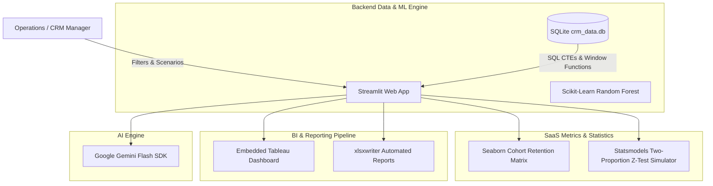

<div align="center">
  <h1> AI-Powered Customer Analytics Platform</h1>
  <p><strong>A Python-based CRM and analytics dashboard that uses SQL, Machine Learning, and A/B testing to help stop customer churn before it happens.</strong></p>
  
  [](https://www.python.org/)
  [](https://streamlit.io/)
  [](https://www.sqlite.org/)
  [](https://scikit-learn.org/)
</div>

<br />

---

## What is this?

In the FinTech world, customers often leave because of technical hiccups (like failed payments). We built this project to be a proactive CRM Command Center. Instead of just staring at past metrics and seeing who already left, this platform helps you predict who *might* leave and gives you the tools to win them back.

### What it actually does:
1. **Predictive Modeling:** We use a Random Forest model (via Scikit-Learn) to figure out which users are most likely to leave us.
2. **Heavy-Lifting Data Engineering:** Under the hood, a local SQLite database runs some pretty complex SQL queries (think CTEs and Window Functions) to instantly pull up high-risk customer groups and show exactly how much revenue is on the line.
3. **Real Statistical Testing:** There's a built-in A/B Testing Simulator so product teams can actually run the numbers on retention campaigns to see if they're mathematically working. 
4. **AI-Written Emails:** We plugged in Google Gemini so the app can automatically draft personalized "please stay" emails based on a user's specific friction points. No more generic templates!

---

## How it's built



---

## Cool Features

* **Real-time SQLite Integration:** The app talks to a local database using parameterized queries to fetch and filter data on the fly.
* **CLV & Cohort Analysis:** Keep track of Customer Lifetime Value and see where users are dropping off using easy-to-read Seaborn heatmaps.
* **A/B Testing Simulator:** Test out your ideas! Compare a control group with a treatment group and let the app do the hard math (Z-scores and P-values) to see if your campaign is a winner.
* **One-Click Excel Reports:** Download multi-sheet `.xlsx` reports that come pre-loaded with charts and conditional formatting. No manual Excel formatting needed.
* **Embedded Tableau Dashboards:** We've baked interactive BI dashboards right into the Streamlit interface so everything lives in one place.

---

## Want to run it yourself?

Here's how to get it up and running on your local machine:

1. **Install the dependencies:**
   ```bash
   pip install -r requirements.txt
   ```
2. **Build the database (The ETL phase):**
   ```bash
   python data_pipeline_for_bi.py
   python database_builder.py
   ```
3. **Spin up the app:**
   ```bash
   streamlit run app.py
   ```