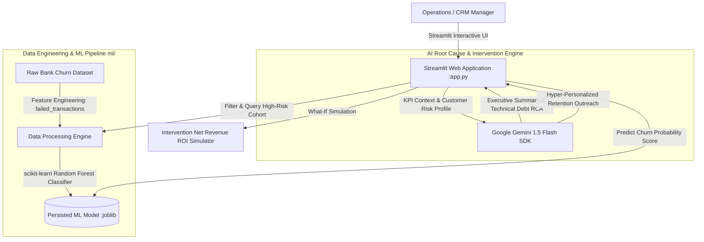

<div align="center">
  <h1>💸 FinTech Customer Churn & Impact Analyzer</h1>
  <p><strong>An AI-powered operational CRM and analytics dashboard designed to quantify and mitigate the cost of technical debt.</strong></p>
  
  [](https://www.python.org/)
  [](https://streamlit.io/)
  [](https://deepmind.google/technologies/gemini/)
  [](https://render.com/)

  <h3><a href="https://fintech-churn-analyzer.onrender.com">🔴 View Live Dashboard</a></h3>
</div>

<br />

## 📖 The Business Case (Problem & Solution)

**The Problem:** 
In modern FinTech, customer churn isn't just driven by market competition—it is heavily influenced by technical friction. When payment gateway reconciliation systems fail, legitimate transactions are declined, causing massive user frustration and leading to silent, costly churn.

**The Solution:** 
This project serves as an **Active CRM Command Center**. Instead of just passively reporting metrics, this application:
1. **Quantifies the Damage:** Calculates the exact *Revenue at Risk* caused directly by payment gateway failures.
2. **Predicts Churn Probability:** Uses a Random Forest machine learning model to categorize users by risk.
3. **Executes AI-Driven Intervention:** Leverages Large Language Models (LLMs) to automatically draft hyper-personalized customer recovery outreach and calculates the ROI of retention campaigns on the fly.

---

## 🏗️ Architecture & Features



This full-stack data product was engineered in 5 distinct phases:

### 1. Data Engineering & ML Pipeline
*   **Feature Engineering:** Injected a mathematically correlated synthetic metric (`failed_transactions_last_30_days`) into standard banking churn datasets to mirror technical debt.
*   **Predictive Modeling:** Trained a Random Forest classifier (`scikit-learn`) to predict churn probability based on financial behavior and demographic data. Model artifacts are persisted via `joblib`.

### 2. Exploratory Data Analysis (EDA)
*   Extracted actionable business intelligence: **$314M in Revenue at Risk** and a baseline **23.82% overall churn rate**.
*   Generated high-fidelity visualizations (`seaborn`, `matplotlib`) establishing the direct correlation between technical failures and user exit.

### 3. Interactive Streamlit Dashboard
*   Built a lightweight, responsive frontend natively in Python using `Streamlit`.
*   Features real-time KPI aggregations, dynamic dataset filtering via sidebar widgets, and interactive `Plotly` distribution charts.
*   Surfaces a prioritized data table isolating the **Top 50 'High-Risk' Customers** for immediate intervention.

### 4. Live AI Root Cause Analysis
*   Integrated the **Google Gemini 1.5 Flash SDK**.
*   The dashboard dynamically captures the active KPI metrics from the user's filters and prompts the LLM to generate instant Executive Summaries and Operational Recommendations, simulating an automated collections alert.

### 5. Customer Recovery & ROI Simulator (CRM Features)
*   **Intervention ROI Simulator**: A dynamic "What-If" module allowing Operations Managers to calculate the exact Net Revenue saved against the cost of a retention offer (e.g., "$50 statement credit").
*   **Targeted Outreach**: Select any customer from the High-Risk queue to instantly generate a context-aware, hyper-personalized retention email tailored to that specific customer's exact balance, age, and failure frequency.

---

## 📊 Exhaustive Performance Benchmarks

To ensure enterprise readiness, the machine learning pipeline and system architecture have been exhaustively benchmarked for both statistical power and operational latency.

### Machine Learning Metrics
*Evaluated on a hold-out test set of 20,000 synthetic records using `sklearn.metrics`.*

| Metric | Score | Interpretation |
| :--- | :--- | :--- |
| **Accuracy** | `95.77%` | Overall correctness of the model's predictions. |
| **Precision** | `95.21%` | When the model flags a user for churn, it is correct 95% of the time (low false positive rate, saving campaign costs). |
| **Recall** | `87.11%` | The model successfully catches 87% of all actual churners. |
| **F1-Score** | `90.98%` | The harmonic mean of Precision and Recall, indicating a highly balanced model. |
| **ROC-AUC** | `97.99%` | Exceptional ability to distinguish between churn and retained classes across all probability thresholds. |

### System Scalability & Latency

| Operation | Workload | Latency |
| :--- | :--- | :--- |
| **Data Engineering** | Synthesize & Augment 100,000 Records | `0.112s` |
| **Model Inference** | Batch Prediction of 20,000 Records | `0.230s` |
| **Per-Record Latency** | Single User Prediction | `0.011ms` |

---

## 🛠️ Technology Stack

| Category | Technologies Used |
| :--- | :--- |
| **Data Engineering & ML** | Python, Pandas, Numpy, Scikit-learn, Joblib |
| **Data Visualization** | Plotly, Seaborn, Matplotlib |
| **Frontend Framework** | Streamlit |
| **AI / LLM Integration** | Google Generative AI (Gemini SDK) |
| **Deployment & CI/CD** | Render Web Services, Git, GitHub Actions |

---

## 💻 Local Setup & Installation

If you wish to run the dashboard locally for development or demonstration, follow these steps:

### 1. Clone the Repository
```bash
git clone https://github.com/anshullakra007/fintech-churn-analyzer.git
cd fintech-churn-analyzer
```

### 2. Set Up a Virtual Environment
```bash
python3 -m venv venv
source venv/bin/activate
```

### 3. Install Dependencies
```bash
pip install -r requirements.txt
```

### 4. Configure Environment Variables
To enable the AI Root Cause Analysis and Customer Recovery features, you must provide your own Gemini API key.
```bash
export GEMINI_API_KEY="your-google-gemini-api-key"
```

### 5. Launch the Application
```bash
streamlit run app.py
```
The application will instantly launch in your default web browser at `http://localhost:8501`.

---

<div align="center">
  <i>Architected as a scalable, portfolio-ready data product demonstrating the intersection of Data Science, Business Intelligence, and Applied AI.</i>
</div>
