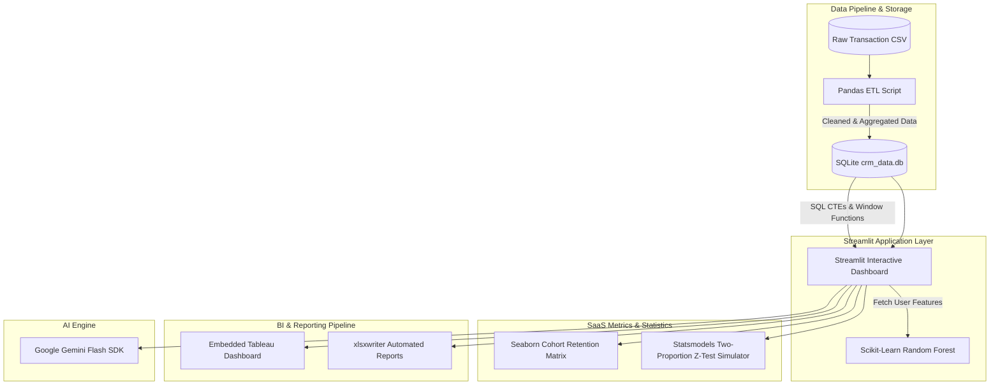

#  AI-Powered Customer Analytics & Churn Predictor  

An AI-driven operational CRM and analytics dashboard I built to help teams figure out why customers are leaving and what to do about it. It uses machine learning to predict churn and generative AI to automatically draft personalized emails to win them back!

##  How It Works



---

##  Cool Features

* **Real-time SQLite Integration:** The app connects directly to a local database using parameterized queries so you can fetch and filter data on the fly.
* **CLV & Cohort Analysis:** Keep track of Customer Lifetime Value and easily spot where users drop off using beautiful Seaborn heatmaps.
* **A/B Testing Simulator:** Got a wild idea? Compare a control group with a treatment group and let the app do the heavy lifting (Z-scores and P-values) to see if it's a winner.
* **One-Click Excel Reports:** Export multi-sheet `.xlsx` reports pre-loaded with charts and conditional formatting. No more manual spreadsheet tinkering!
* **Embedded Tableau Dashboards:** Interactive BI dashboards are baked right into the Streamlit interface, keeping everything in one place.
* **AI Email Drafting:** It uses Google's Gemini Flash SDK to automatically write personalized retention emails based on the customer's specific churn risk factors!

---

##  Want to run it yourself?

Here's how to spin it up on your local machine:

1. **Install the dependencies:**
   ```bash
   pip install -r requirements.txt
   ```
2. **Build the database (The ETL phase):**
   ```bash
   python data_pipeline_for_bi.py
   python database_builder.py
   ```
3. **Fire up the app:**
   ```bash
   streamlit run app.py
   ```