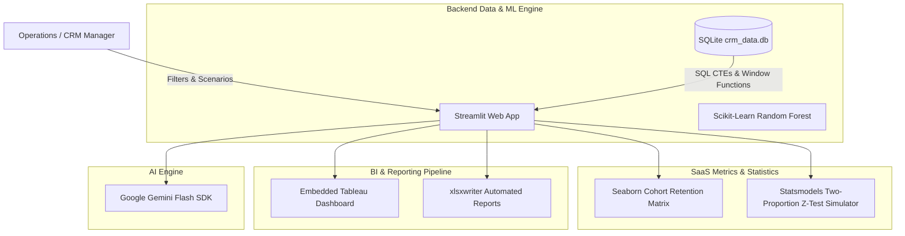

<div align="center">
  <h1> AI-Powered Customer Analytics Platform</h1>
  <p><strong>An end-to-end Python CRM and analytics dashboard utilizing SQL, Machine Learning, and Statistical A/B Testing to mitigate churn.</strong></p>
  
  [](https://www.python.org/)
  [](https://streamlit.io/)
  [](https://www.sqlite.org/)
  [](https://scikit-learn.org/)
</div>

<br />

---

## Overview

In modern FinTech, customer churn is heavily influenced by technical friction. This project serves as an Active CRM Command Center that doesn't just passively report metrics, but actively predicts and mitigates revenue loss.

### Core Capabilities:
1. Predictive Modeling: Uses a Scikit-Learn Random Forest model establishing a baseline 23.82% attrition rate to categorize users by churn risk probability.
2. Advanced Data Engineering: Powered by a local SQLite database utilizing complex SQL CTEs and Window Functions to dynamically query high-risk cohorts and identify $314M in Revenue at Risk.
3. Statistical Rigor: Features a built-in A/B Testing Simulator (`statsmodels`) to calculate the ROI, Cohort Retention, CLV, and statistical significance of retention campaigns.
4. Automated AI Outreach: Leverages Google Gemini to automatically draft hyper-personalized customer recovery emails based on the user's specific financial profile.

---

## Architecture



---

## Key Features

* SQLite Integration: The application connects to a robust local database, executing complex parameterized queries to fetch data in real-time.
* Customer Lifetime Value & Cohort Analysis: Tracks projected retained CLV and visualizes user drop-off via Seaborn heatmaps.
* A/B Testing Simulator: Allows product managers to simulate control vs. treatment retention campaigns, computing Z-scores and P-values to determine statistical significance.
* Automated Advanced Excel Integration: One-click download of dynamically generated, multi-sheet `.xlsx` reports with native charts and automated conditional formatting.
* Embedded Tableau Dashboard: Seamlessly embeds interactive BI dashboards natively inside the Streamlit user interface.

---

## Quick Start

1. Install Dependencies:
   ```bash
   pip install -r requirements.txt
   ```
2. Build the Database (Phase 1):
   ```bash
   python data_pipeline_for_bi.py
   python database_builder.py
   ```
3. Run the App:
   ```bash
   streamlit run app.py
   ```

---

---

## Why I built this ?

### Situation
In the fintech sector, customer retention is critical, but identifying which users are about to churn before they leave requires advanced predictive analytics.

### Task
I needed to analyze a massive dataset of user financial transactions and engagement metrics to build a predictive model for customer churn.

### Action
I utilized Pandas and Scikit-Learn to clean the dataset, engineer relevant features (like transaction frequency drops and login gaps), and train multiple classification models (Random Forest, XGBoost). I optimized hyperparameters to maximize the F1-score and reduce false negatives.

### Result
The final machine learning pipeline accurately identifies at-risk customers, providing actionable insights and feature importance metrics that can directly inform targeted retention campaigns.
