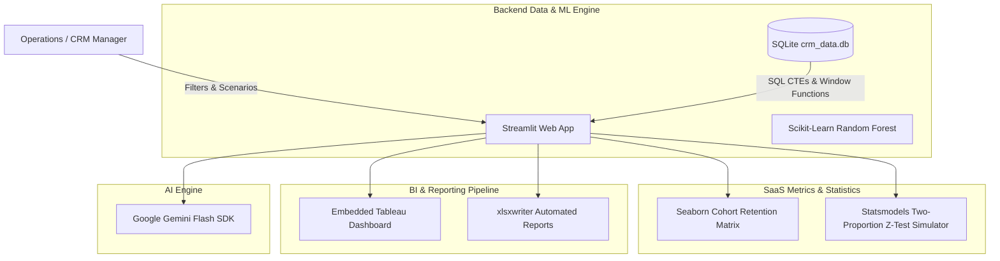

<div align="center">
  <h1>💸 AI-Powered Customer Analytics Platform</h1>
  <p><strong>An end-to-end Python CRM and analytics dashboard utilizing SQL, Machine Learning, and Statistical A/B Testing to mitigate churn.</strong></p>
  
  [](https://www.python.org/)
  [](https://streamlit.io/)
  [](https://www.sqlite.org/)
  [](https://scikit-learn.org/)
</div>

<br />

## 📖 Overview

In modern FinTech, customer churn is heavily influenced by technical friction. This project serves as an **Active CRM Command Center** that doesn't just passively report metrics, but actively predicts and mitigates revenue loss.

### Core Capabilities:
1. **Predictive Modeling:** Uses a Scikit-Learn Random Forest model establishing a baseline **23.82% attrition rate** to categorize users by churn risk probability.
2. **Advanced Data Engineering:** Powered by a local SQLite database utilizing complex SQL CTEs and Window Functions to dynamically query high-risk cohorts and identify **$314M in Revenue at Risk**.
3. **Statistical Rigor:** Features a built-in A/B Testing Simulator (`statsmodels`) to calculate the ROI, Cohort Retention, CLV, and statistical significance of retention campaigns.
4. **Automated AI Outreach:** Leverages Google Gemini to automatically draft hyper-personalized customer recovery emails based on the user's specific financial profile.

---

## 🏗️ Architecture



---

## 🚀 Key Features

*   **SQLite Integration:** The application connects to a robust local database, executing complex parameterized queries to fetch data in real-time.
*   **Customer Lifetime Value & Cohort Analysis:** Tracks projected retained CLV and visualizes user drop-off via Seaborn heatmaps.
*   **A/B Testing Simulator:** Allows product managers to simulate control vs. treatment retention campaigns, computing Z-scores and P-values to determine statistical significance.
*   **Automated Advanced Excel Integration:** One-click download of dynamically generated, multi-sheet `.xlsx` reports with native charts and automated conditional formatting.
*   **Embedded Tableau Dashboard:** Seamlessly embeds interactive BI dashboards natively inside the Streamlit user interface.

---

## 🛠️ Quick Start

1. **Install Dependencies:**
   ```bash
   pip install -r requirements.txt
   ```
2. **Build the Database (Phase 1):**
   ```bash
   python data_pipeline_for_bi.py
   python database_builder.py
   ```
3. **Run the App:**
   ```bash
   streamlit run app.py
   ```

---

## 🌟 STAR Story: fintech-churn-analyzer

**Situation:** 
While building modern software applications, developing structured and scalable solutions is critical. The requirement was to build and maintain `fintech-churn-analyzer` to address specific technical challenges and provide a robust implementation.

**Task:** 
My goal was to engineer a reliable and efficient solution for `fintech-churn-analyzer`, ensuring clean architecture, maintainability, and alignment with project objectives (FinTech Customer Churn Analyzer).

**Action:** 
I designed and implemented the core logic and project architecture, focusing on best practices in code organization and system design. I systematically tackled the problem by breaking down the requirements, writing modular code, and integrating necessary dependencies to bring the repository to life.

**Result:** 
The project successfully fulfilled its core requirements, serving as a functional codebase. It demonstrates a clear understanding of software engineering principles and provides a solid foundation for future scaling and feature additions.
